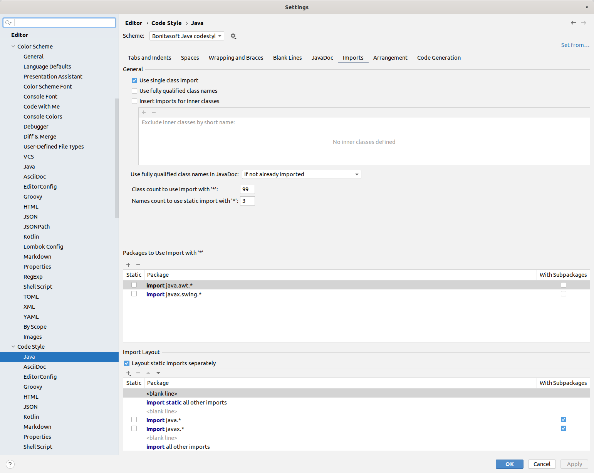
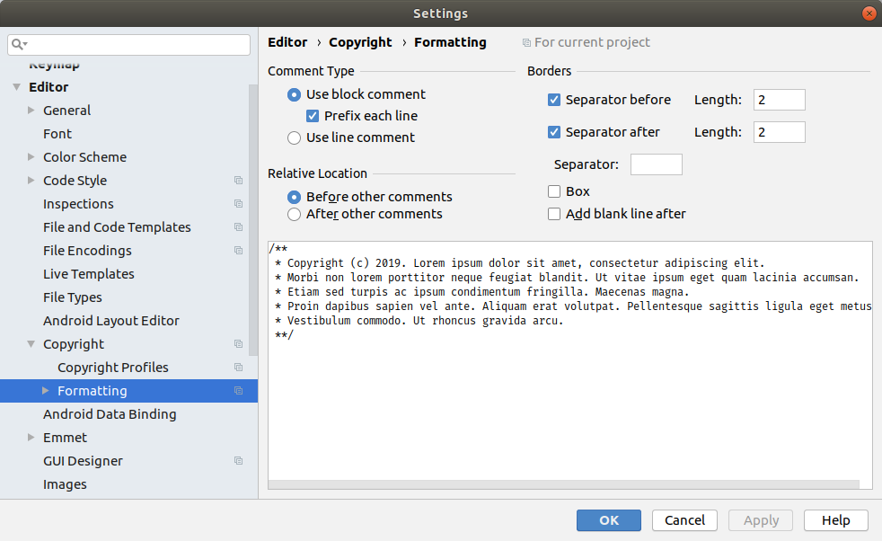

# Code style

In the following, you will find how to configure your favorite IDE to match the Bonita code style.

## Eclipse IDE configuration

Predefined configurations for formatter and templates to install in Eclipse IDE.

### Clean Up

* Go to `Preferences` > `Java` > `Code Style` > `Clean Up` panel
* Click on _Import..._
* Select [cleanUp.xml](cleanUp.xml)
* Set _BOS-CleanUp_ as Active profile

### Code Templates

* Go to `Preferences` > `Java` > `Code Style` > `Code Templates` panel
* Click on _Import..._
* Select [codetemplates-community.xml](codetemplates-community.xml) or [codetemplates-subsciption.xml](codetemplates-subsciption.xml)

### Formatter

* Go to `Preferences` > `Java` > `Code Style` > `Formatter` panel
* Click on _Import..._
* Select [formatter.xml](formatter.xml)
* Set _BOS-formatter_ as Active profile

## IntelliJ IDEA configuration

### Formatter

Install the `Eclipse Code Formatter` plugin.  
Then in the plugin settings, configure as in the following:


### Imports

In the `Code Style > Java` settings, configure as in the following:




In order to auto organize imports on the fly, go to `Editor > General > Auto import` and check all options:


### Copyright headers

With Intellij it's possible to define different headers for community and subscription code.  
In the Scopes settings
* create a scope named `Community`
* in the `Pattern` field enter `org.bonitasoft..*`
* check the box "Share scope" 

Repeat the operation to create the `Subscription` scope. Use the pattern `com.bonitasoft..*`

You should have something like in the following:


The, create two new profiles using the `Copyright > Copyright Profiles`

Community profile with content:
```
Copyright (C) $today.year Bonitasoft S.A.
Bonitasoft, 32 rue Gustave Eiffel - 38000 Grenoble
This library is free software; you can redistribute it and/or modify it under the terms
of the GNU Lesser General Public License as published by the Free Software Foundation
version 2.1 of the License.
This library is distributed in the hope that it will be useful, but WITHOUT ANY WARRANTY;
without even the implied warranty of MERCHANTABILITY or FITNESS FOR A PARTICULAR PURPOSE.
See the GNU Lesser General Public License for more details.
You should have received a copy of the GNU Lesser General Public License along with this
program; if not, write to the Free Software Foundation, Inc., 51 Franklin Street, Fifth
Floor, Boston, MA 02110-1301, USA.
```

Subscription profile with content:
```
Copyright (C) $today.year Bonitasoft S.A.
Bonitasoft is a trademark of Bonitasoft SA.
This software file is BONITASOFT CONFIDENTIAL. Not For Distribution.
For commercial licensing information, contact:
Bonitasoft, 32 rue Gustave Eiffel – 38000 Grenoble
or Bonitasoft US, 51 Federal Street, Suite 305, San Francisco, CA 94107
```

You should have something like in the following:


Finally, go to the `Copyright > Formatting` and configure as in the following:


